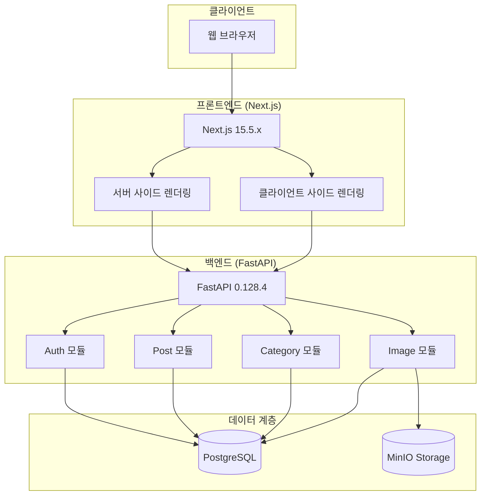
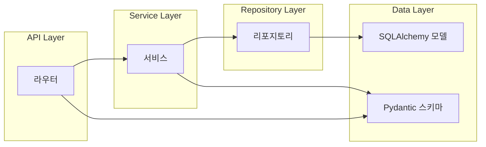
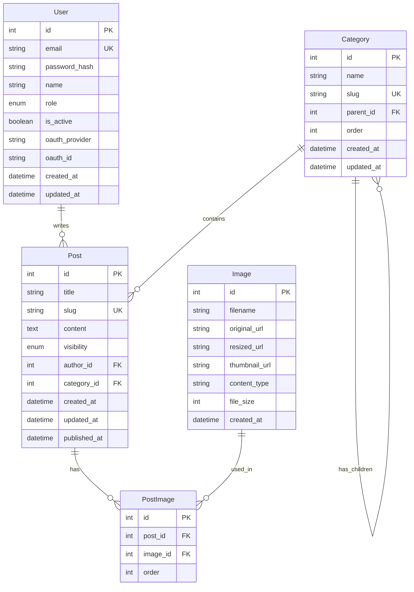

# 설계 문서

## 개요

통합 블로그 시스템은 테크 블로그와 가족 사진을 하나의 플랫폼에서 관리하는 풀스택 웹 애플리케이션입니다. 백엔드는 Python FastAPI로 RESTful API를 제공하고, 프론트엔드는 Next.js로 서버 사이드 렌더링과 정적 생성을 활용합니다. PostgreSQL을 데이터베이스로, MinIO를 이미지 스토리지로 사용합니다.

### 핵심 설계 원칙

- **관심사 분리**: 인증, 포스트, 카테고리, 이미지 서비스를 독립적인 모듈로 구성

- **비동기 처리**: SQLAlchemy Async와 asyncpg를 활용한 비동기 데이터베이스 작업

- **확장성**: 추후 다중 작성자 지원을 위한 역할 기반 접근 제어(RBAC) 설계

- **보안**: JWT 기반 인증, bcrypt 비밀번호 해싱, 접근 권한 검증

## 아키텍처

### 시스템 아키텍처 다이어그램



### 백엔드 레이어 구조



## 컴포넌트 및 인터페이스

### 백엔드 디렉토리 구조

```
backend/
├── app/
│   ├── __init__.py
│   ├── main.py                 # FastAPI 앱 진입점
│   ├── config.py               # 환경 설정
│   ├── database.py             # DB 연결 설정
│   │
│   ├── auth/                   # 인증 모듈
│   │   ├── __init__.py
│   │   ├── router.py           # 인증 API 엔드포인트
│   │   ├── service.py          # 인증 비즈니스 로직
│   │   ├── repository.py       # 사용자 데이터 접근
│   │   ├── schemas.py          # Pydantic 스키마
│   │   ├── models.py           # SQLAlchemy 모델
│   │   └── dependencies.py     # 인증 의존성
│   │
│   ├── posts/                  # 포스트 모듈
│   │   ├── __init__.py
│   │   ├── router.py
│   │   ├── service.py
│   │   ├── repository.py
│   │   ├── schemas.py
│   │   └── models.py
│   │
│   ├── categories/             # 카테고리 모듈
│   │   ├── __init__.py
│   │   ├── router.py
│   │   ├── service.py
│   │   ├── repository.py
│   │   ├── schemas.py
│   │   └── models.py
│   │
│   ├── images/                 # 이미지 모듈
│   │   ├── __init__.py
│   │   ├── router.py
│   │   ├── service.py
│   │   ├── repository.py
│   │   ├── schemas.py
│   │   └── models.py
│   │
│   └── common/                 # 공통 유틸리티
│       ├── __init__.py
│       ├── responses.py        # 응답 형식
│       ├── exceptions.py       # 커스텀 예외
│       └── pagination.py       # 페이지네이션
│
├── alembic/                    # DB 마이그레이션
│   └── versions/
│
├── tests/                      # 테스트
│   ├── conftest.py
│   ├── test_auth/
│   ├── test_posts/
│   ├── test_categories/
│   └── test_images/
│
├── alembic.ini
├── requirements.txt
└── Dockerfile
```

### 프론트엔드 디렉토리 구조

```
frontend/
├── src/
│   ├── app/                    # Next.js App Router
│   │   ├── layout.tsx
│   │   ├── page.tsx            # 홈페이지
│   │   ├── (public)/           # 공개 라우트 그룹
│   │   │   ├── blog/
│   │   │   │   ├── page.tsx    # 블로그 목록
│   │   │   │   └── [slug]/
│   │   │   │       └── page.tsx
│   │   │   └── category/
│   │   │       └── [slug]/
│   │   │           └── page.tsx
│   │   │
│   │   ├── (private)/          # 비공개 라우트 그룹
│   │   │   └── family/
│   │   │       ├── page.tsx
│   │   │       └── [slug]/
│   │   │           └── page.tsx
│   │   │
│   │   ├── admin/              # 관리자 라우트
│   │   │   ├── layout.tsx
│   │   │   ├── posts/
│   │   │   ├── categories/
│   │   │   └── users/
│   │   │
│   │   ├── login/
│   │   │   └── page.tsx
│   │   │
│   │   └── api/                # API 라우트 (프록시용)
│   │
│   ├── components/             # 재사용 컴포넌트
│   │   ├── ui/                 # 기본 UI 컴포넌트
│   │   ├── posts/              # 포스트 관련 컴포넌트
│   │   ├── categories/         # 카테고리 관련 컴포넌트
│   │   └── layout/             # 레이아웃 컴포넌트
│   │
│   ├── lib/                    # 유틸리티
│   │   ├── api.ts              # API 클라이언트
│   │   ├── auth.ts             # 인증 유틸리티
│   │   └── utils.ts            # 공통 유틸리티
│   │
│   ├── hooks/                  # 커스텀 훅
│   │   ├── useAuth.ts
│   │   └── usePosts.ts
│   │
│   └── types/                  # TypeScript 타입
│       └── index.ts
│
├── public/
├── package.json
├── next.config.js
├── tailwind.config.js
└── Dockerfile
```

### 주요 API 엔드포인트

#### 인증 API

| 메서드 | 경로 | 설명 | 인증 |
|--------|------|------|------|
| POST | `/api/v1/auth/login` | 로그인 | 불필요 |
| POST | `/api/v1/auth/refresh` | 토큰 갱신 | 리프레시 토큰 |
| POST | `/api/v1/auth/logout` | 로그아웃 | 필요 |
| GET | `/api/v1/auth/me` | 현재 사용자 정보 | 필요 |

#### 사용자 API (관리자 전용)

| 메서드 | 경로 | 설명 | 인증 |
|--------|------|------|------|
| GET | `/api/v1/users` | 사용자 목록 | ADMIN |
| POST | `/api/v1/users` | 사용자 생성 | ADMIN |
| DELETE | `/api/v1/users/{id}` | 사용자 비활성화 | ADMIN |

#### 포스트 API

| 메서드 | 경로 | 설명 | 인증 |
|--------|------|------|------|
| GET | `/api/v1/posts` | 포스트 목록 | 선택적 |
| GET | `/api/v1/posts/{slug}` | 포스트 상세 | 선택적 |
| POST | `/api/v1/posts` | 포스트 생성 | ADMIN |
| PUT | `/api/v1/posts/{id}` | 포스트 수정 | ADMIN |
| DELETE | `/api/v1/posts/{id}` | 포스트 삭제 | ADMIN |

#### 카테고리 API

| 메서드 | 경로 | 설명 | 인증 |
|--------|------|------|------|
| GET | `/api/v1/categories` | 카테고리 트리 | 불필요 |
| POST | `/api/v1/categories` | 카테고리 생성 | ADMIN |
| PUT | `/api/v1/categories/{id}` | 카테고리 수정 | ADMIN |
| DELETE | `/api/v1/categories/{id}` | 카테고리 삭제 | ADMIN |

#### 이미지 API

| 메서드 | 경로 | 설명 | 인증 |
|--------|------|------|------|
| POST | `/api/v1/images/upload` | 이미지 업로드 | ADMIN |
| GET | `/api/v1/images/{id}` | 이미지 조회 | 선택적 |
| DELETE | `/api/v1/images/{id}` | 이미지 삭제 | ADMIN |

### 서비스 인터페이스

#### AuthService

```python
class AuthService:
    async def login(self, email: str, password: str) -> TokenResponse:
        """사용자 로그인 처리 및 토큰 발급"""
        pass

    async def refresh_token(self, refresh_token: str) -> TokenResponse:
        """리프레시 토큰으로 새 액세스 토큰 발급"""
        pass

    async def verify_token(self, token: str) -> UserPayload:
        """액세스 토큰 검증 및 사용자 정보 추출"""
        pass

    async def create_user(self, user_data: UserCreate) -> User:
        """새 사용자 생성"""
        pass

    async def get_users(self) -> list[User]:
        """모든 사용자 목록 조회"""
        pass

    async def deactivate_user(self, user_id: int) -> None:
        """사용자 비활성화"""
        pass
```

#### PostService

```python
class PostService:
    async def create_post(self, post_data: PostCreate, author_id: int) -> Post:
        """새 포스트 생성"""
        pass

    async def update_post(self, post_id: int, post_data: PostUpdate) -> Post:
        """포스트 수정"""
        pass

    async def delete_post(self, post_id: int) -> None:
        """포스트 삭제"""
        pass

    async def get_post_by_slug(self, slug: str, user: User | None) -> Post:
        """슬러그로 포스트 조회 (권한 검증 포함)"""
        pass

    async def get_posts(
        self,
        user: User | None,
        category_id: int | None,
        page: int,
        size: int
    ) -> PaginatedResponse[Post]:
        """포스트 목록 조회 (권한 기반 필터링)"""
        pass

    def generate_slug(self, title: str) -> str:
        """제목에서 슬러그 생성"""
        pass
```

#### CategoryService

```python
class CategoryService:
    async def create_category(self, category_data: CategoryCreate) -> Category:
        """새 카테고리 생성"""
        pass

    async def get_category_tree(self) -> list[CategoryTree]:
        """계층 구조 카테고리 트리 조회"""
        pass

    async def delete_category(self, category_id: int) -> None:
        """카테고리 삭제 (포스트 존재 시 거부)"""
        pass
```

#### ImageService

```python
class ImageService:
    async def upload_image(self, file: UploadFile) -> Image:
        """이미지 업로드, 리사이징, 썸네일 생성"""
        pass

    async def get_image_url(self, image_id: int, size: str) -> str:
        """이미지 URL 조회"""
        pass

    async def delete_image(self, image_id: int) -> None:
        """이미지 삭제"""
        pass

    def resize_image(self, image_data: bytes, max_size: tuple[int, int]) -> bytes:
        """이미지 리사이징"""
        pass

    def create_thumbnail(self, image_data: bytes) -> bytes:
        """썸네일 생성"""
        pass
```

## 데이터 모델

### ERD (Entity Relationship Diagram)



### SQLAlchemy 모델 정의

#### User 모델

```python
from enum import Enum
from sqlalchemy import Column, Integer, String, Boolean, DateTime, Enum as SQLEnum
from sqlalchemy.orm import relationship
from datetime import datetime

class UserRole(str, Enum):
    ADMIN = "admin"
    FAMILY_MEMBER = "family_member"

class User(Base):
    __tablename__ = "users"

    id = Column(Integer, primary_key=True, index=True)
    email = Column(String(255), unique=True, nullable=False, index=True)
    password_hash = Column(String(255), nullable=True)  # OAuth 사용자는 null 가능
    name = Column(String(100), nullable=False)
    role = Column(SQLEnum(UserRole), nullable=False, default=UserRole.FAMILY_MEMBER)
    is_active = Column(Boolean, default=True)
    
    # OAuth 확장을 위한 필드 (추후 SSO 구현 시 사용)
    oauth_provider = Column(String(50), nullable=True)  # 'google', 'naver' 등
    oauth_id = Column(String(255), nullable=True)  # OAuth 제공자의 사용자 ID
    
    created_at = Column(DateTime, default=datetime.utcnow)
    updated_at = Column(DateTime, default=datetime.utcnow, onupdate=datetime.utcnow)

    # 관계
    posts = relationship("Post", back_populates="author")
```

#### Category 모델

```python
class Category(Base):
    __tablename__ = "categories"

    id = Column(Integer, primary_key=True, index=True)
    name = Column(String(100), nullable=False)
    slug = Column(String(100), unique=True, nullable=False, index=True)
    parent_id = Column(Integer, ForeignKey("categories.id"), nullable=True)
    order = Column(Integer, default=0)
    created_at = Column(DateTime, default=datetime.utcnow)
    updated_at = Column(DateTime, default=datetime.utcnow, onupdate=datetime.utcnow)

    # 관계
    parent = relationship("Category", remote_side=[id], back_populates="children")
    children = relationship("Category", back_populates="parent")
    posts = relationship("Post", back_populates="category")
```

#### Post 모델

```python
class Visibility(str, Enum):
    PUBLIC = "public"
    PRIVATE = "private"

class Post(Base):
    __tablename__ = "posts"

    id = Column(Integer, primary_key=True, index=True)
    title = Column(String(255), nullable=False)
    slug = Column(String(255), unique=True, nullable=False, index=True)
    content = Column(Text, nullable=False)
    visibility = Column(SQLEnum(Visibility), nullable=False, default=Visibility.PUBLIC)
    author_id = Column(Integer, ForeignKey("users.id"), nullable=False)
    category_id = Column(Integer, ForeignKey("categories.id"), nullable=True)
    created_at = Column(DateTime, default=datetime.utcnow)
    updated_at = Column(DateTime, default=datetime.utcnow, onupdate=datetime.utcnow)
    published_at = Column(DateTime, nullable=True)

    # 관계
    author = relationship("User", back_populates="posts")
    category = relationship("Category", back_populates="posts")
    images = relationship("PostImage", back_populates="post")
```

#### Image 모델

```python
class Image(Base):
    __tablename__ = "images"

    id = Column(Integer, primary_key=True, index=True)
    filename = Column(String(255), nullable=False)
    original_url = Column(String(500), nullable=False)
    resized_url = Column(String(500), nullable=False)
    thumbnail_url = Column(String(500), nullable=False)
    content_type = Column(String(50), nullable=False)
    file_size = Column(Integer, nullable=False)
    created_at = Column(DateTime, default=datetime.utcnow)

    # 관계
    post_images = relationship("PostImage", back_populates="image")

class PostImage(Base):
    __tablename__ = "post_images"

    id = Column(Integer, primary_key=True, index=True)
    post_id = Column(Integer, ForeignKey("posts.id"), nullable=False)
    image_id = Column(Integer, ForeignKey("images.id"), nullable=False)
    order = Column(Integer, default=0)

    # 관계
    post = relationship("Post", back_populates="images")
    image = relationship("Image", back_populates="post_images")
```

### Pydantic 스키마

#### 인증 스키마

```python
from pydantic import BaseModel, EmailStr

class LoginRequest(BaseModel):
    email: EmailStr
    password: str

class TokenResponse(BaseModel):
    access_token: str
    refresh_token: str
    token_type: str = "bearer"

class UserPayload(BaseModel):
    user_id: int
    email: str
    role: UserRole

class UserCreate(BaseModel):
    email: EmailStr
    password: str
    name: str
    role: UserRole = UserRole.FAMILY_MEMBER

class UserResponse(BaseModel):
    id: int
    email: str
    name: str
    role: UserRole
    is_active: bool
    created_at: datetime

    class Config:
        from_attributes = True
```

#### 포스트 스키마

```python
class PostCreate(BaseModel):
    title: str
    content: str
    visibility: Visibility = Visibility.PUBLIC
    category_id: int | None = None

class PostUpdate(BaseModel):
    title: str | None = None
    content: str | None = None
    visibility: Visibility | None = None
    category_id: int | None = None

class PostResponse(BaseModel):
    id: int
    title: str
    slug: str
    content: str
    visibility: Visibility
    author: UserResponse
    category: CategoryResponse | None
    created_at: datetime
    updated_at: datetime

    class Config:
        from_attributes = True

class PostListItem(BaseModel):
    id: int
    title: str
    slug: str
    visibility: Visibility
    author_name: str
    category_name: str | None
    created_at: datetime

    class Config:
        from_attributes = True
```

#### 카테고리 스키마

```python
class CategoryCreate(BaseModel):
    name: str
    parent_id: int | None = None

class CategoryResponse(BaseModel):
    id: int
    name: str
    slug: str
    parent_id: int | None
    order: int

    class Config:
        from_attributes = True

class CategoryTree(BaseModel):
    id: int
    name: str
    slug: str
    children: list["CategoryTree"] = []

    class Config:
        from_attributes = True
```

#### 이미지 스키마

```python
class ImageResponse(BaseModel):
    id: int
    filename: str
    original_url: str
    resized_url: str
    thumbnail_url: str
    content_type: str
    file_size: int
    created_at: datetime

    class Config:
        from_attributes = True

class ImageUploadResponse(BaseModel):
    id: int
    url: str
    thumbnail_url: str
```

#### 공통 응답 스키마

```python
from typing import TypeVar, Generic

T = TypeVar("T")

class ApiResponse(BaseModel, Generic[T]):
    data: T
    message: str | None = None

class ErrorResponse(BaseModel):
    error: str
    message: str
    details: dict | None = None

class PaginationMeta(BaseModel):
    page: int
    size: int
    total: int
    total_pages: int

class PaginatedResponse(BaseModel, Generic[T]):
    data: list[T]
    pagination: PaginationMeta
```


## UI 디자인 가이드

### 테마 및 색상

- **라이트 모드 전용**: 다크 모드는 지원하지 않으며, 밝고 깔끔한 화이트 톤 기반 디자인
- **기본 배경**: `#FFFFFF` (순백), 보조 배경: `#F9FAFB` (gray-50)
- **텍스트 색상**: `#111827` (gray-900) 기본, `#6B7280` (gray-500) 보조
- **액센트 색상**: `#3B82F6` (blue-500) 링크 및 인터랙티브 요소
- **보더 색상**: `#E5E7EB` (gray-200) 구분선 및 카드 테두리
- **미니멀한 느낌**: 불필요한 장식 요소를 배제하고 콘텐츠 중심의 깔끔한 UI

### 레이아웃 구조

```
┌─────────────────────────────────────────────────┐
│  Header (로고, 네비게이션, 로그인 버튼)            │
├──────────┬──────────────────────────────────────┤
│          │                                      │
│ Sidebar  │         메인 콘텐츠 영역               │
│ (접이식)  │                                      │
│          │                                      │
│ - 카테고리│                                      │
│   트리    │                                      │
│ - 네비    │                                      │
│          │                                      │
├──────────┴──────────────────────────────────────┤
│  Footer                                         │
└─────────────────────────────────────────────────┘
```

#### 접이식(Collapsible) 사이드바

- **데스크톱**: 기본 펼침 상태, 토글 버튼으로 접기/펼치기 가능
- **모바일 (768px 미만)**: 기본 접힘 상태, 햄버거 메뉴로 오버레이 형태 표시
- **사이드바 너비**: 펼침 시 `w-64` (256px), 접힘 시 `w-0` (완전 숨김)
- **사이드바 콘텐츠**: 카테고리 트리 네비게이션, 블로그/가족 섹션 전환
- **전환 애니메이션**: `transition-all duration-300 ease-in-out`

#### 메인 콘텐츠 영역

- 사이드바 상태에 따라 유동적으로 너비 조절
- 최대 너비: `max-w-4xl` (포스트 상세), `max-w-6xl` (목록 페이지)
- 좌우 패딩: `px-4 md:px-8`

### 테크 블로그 / 가족 사진 영역 통일

- 두 영역은 **동일한 레이아웃, 카드 스타일, 타이포그래피**를 사용
- 카테고리 트리에서 "테크 블로그" / "가족 앨범" 최상위 카테고리로 구분
- 포스트 카드: 동일한 `rounded-lg border shadow-sm` 스타일
- 가족 사진 영역은 이미지 썸네일 비중이 높은 그리드 레이아웃 (`grid-cols-2 md:grid-cols-3`)
- 테크 블로그 영역은 텍스트 중심 리스트 레이아웃

### 스타일링 도구

- **Tailwind CSS**: 유틸리티 퍼스트 CSS 프레임워크 사용
- `tailwind.config.js`에서 커스텀 색상 및 폰트 설정
- 컴포넌트 스타일은 Tailwind 클래스 조합으로 구현

### 반응형 디자인 브레이크포인트

| 브레이크포인트 | 너비 | 사이드바 | 레이아웃 |
|---------------|------|---------|---------|
| 모바일 | < 768px | 자동 접힘 (오버레이) | 단일 컬럼 |
| 태블릿 | 768px - 1024px | 접힘 가능 | 2컬럼 |
| 데스크톱 | > 1024px | 기본 펼침 | 2컬럼 (넓은 콘텐츠) |

### 주요 컴포넌트 스타일 가이드

- **카드**: `bg-white rounded-lg border border-gray-200 shadow-sm p-4`
- **버튼 (Primary)**: `bg-blue-500 text-white rounded-md px-4 py-2 hover:bg-blue-600`
- **버튼 (Secondary)**: `bg-white text-gray-700 border border-gray-300 rounded-md px-4 py-2 hover:bg-gray-50`
- **입력 필드**: `border border-gray-300 rounded-md px-3 py-2 focus:ring-2 focus:ring-blue-500 focus:border-blue-500`
- **헤더**: `bg-white border-b border-gray-200 shadow-sm`
- **사이드바**: `bg-white border-r border-gray-200`

## 정확성 속성 (Correctness Properties)

*속성(Property)은 시스템의 모든 유효한 실행에서 참이어야 하는 특성 또는 동작입니다. 속성은 사람이 읽을 수 있는 명세와 기계가 검증할 수 있는 정확성 보장 사이의 다리 역할을 합니다.*

### Property 1: JWT 토큰 라운드트립

*For any* 유효한 사용자에 대해, 로그인으로 발급된 JWT 토큰을 디코딩하면 해당 사용자의 ID와 역할 정보가 포함되어 있어야 한다.

**Validates: Requirements 1.3, 1.7**

### Property 2: 비밀번호 해싱 일관성

*For any* 사용자 생성 요청에 대해, 저장된 비밀번호 해시는 bcrypt 형식이어야 하고, 원본 비밀번호로 검증 시 일치해야 한다.

**Validates: Requirements 1.6**

### Property 3: 인증 실패 처리

*For any* 잘못된 자격 증명(존재하지 않는 이메일 또는 틀린 비밀번호)에 대해, 로그인 요청은 인증 실패 오류를 반환해야 한다.

**Validates: Requirements 1.2**

### Property 4: 토큰 갱신

*For any* 유효한 리프레시 토큰에 대해, 토큰 갱신 요청은 새로운 유효한 액세스 토큰을 반환해야 한다.

**Validates: Requirements 1.5**

### Property 5: 포스트 CRUD 라운드트립

*For any* 유효한 포스트 데이터에 대해, 생성 후 조회하면 동일한 제목, 내용, 공개 범위가 반환되어야 하고, 수정 후 조회하면 변경된 내용이 반영되어야 하며, 삭제 후 조회하면 존재하지 않아야 한다.

**Validates: Requirements 2.1, 2.2, 2.3, 2.4**

### Property 6: 포스트 타임스탬프 순서

*For any* 포스트에 대해, 수정일시는 항상 생성일시보다 같거나 이후여야 한다.

**Validates: Requirements 2.5**

### Property 7: 슬러그 생성 및 고유성

*For any* 포스트 제목에 대해, 생성된 슬러그는 URL-safe 문자만 포함해야 하고, 동일한 제목으로 여러 포스트를 생성해도 각 슬러그는 고유해야 한다.

**Validates: Requirements 2.6, 2.7**

### Property 8: 카테고리 계층 구조 보존

*For any* 부모 카테고리가 지정된 카테고리 생성에 대해, 카테고리 트리 조회 시 해당 카테고리는 지정된 부모의 children 목록에 포함되어야 한다.

**Validates: Requirements 3.1, 3.2, 3.3**

### Property 9: 카테고리 삭제 제약

*For any* 포스트가 존재하는 카테고리에 대해, 삭제 요청은 거부되어야 하고, 포스트가 없는 카테고리 삭제 시 해당 카테고리와 모든 하위 카테고리가 삭제되어야 한다.

**Validates: Requirements 3.4, 3.5**

### Property 10: 카테고리 슬러그 고유성

*For any* 카테고리 이름에 대해, 생성된 슬러그는 시스템 내에서 고유해야 한다.

**Validates: Requirements 3.6**

### Property 11: 접근 권한 기반 포스트 필터링

*For any* 포스트 목록 조회에 대해, 인증되지 않은 사용자에게는 PUBLIC 포스트만 반환되어야 하고, 인증된 사용자에게는 PUBLIC과 PRIVATE 모든 포스트가 반환되어야 한다.

**Validates: Requirements 4.1, 4.2, 4.3**

### Property 12: 카테고리별 포스트 필터링

*For any* 카테고리 ID가 지정된 포스트 목록 조회에 대해, 반환된 모든 포스트의 category_id는 지정된 카테고리 ID와 일치해야 한다.

**Validates: Requirements 4.4**

### Property 13: 페이지네이션 일관성

*For any* 페이지네이션된 포스트 목록 조회에 대해, 반환된 항목 수는 요청된 페이지 크기 이하여야 하고, 모든 페이지를 순회하면 전체 포스트 수와 일치해야 한다.

**Validates: Requirements 4.6**

### Property 14: 이미지 업로드 라운드트립

*For any* 유효한 이미지 파일에 대해, 업로드 후 반환된 URL로 조회하면 이미지 데이터를 받을 수 있어야 한다.

**Validates: Requirements 5.1, 5.4, 5.5**

### Property 15: 이미지 리사이징 제약

*For any* 업로드된 이미지에 대해, 리사이징된 이미지의 너비와 높이는 지정된 최대 크기 이하여야 하고, 썸네일 이미지가 생성되어야 한다.

**Validates: Requirements 5.2, 5.3**

### Property 16: 이미지 형식 검증

*For any* 이미지 업로드 요청에 대해, JPEG, PNG, GIF, WebP 형식은 성공해야 하고, 그 외 형식은 형식 오류를 반환해야 한다.

**Validates: Requirements 5.6, 5.7**

### Property 17: 사용자 CRUD 일관성

*For any* 사용자 생성 요청에 대해, 생성 후 사용자 목록에 해당 사용자가 포함되어야 하고, 삭제 후 해당 사용자의 is_active는 false여야 한다.

**Validates: Requirements 6.1, 6.3, 6.4**

### Property 18: 이메일 고유성

*For any* 이미 존재하는 이메일로 사용자 생성 요청 시, 고유성 위반 오류를 반환해야 한다.

**Validates: Requirements 6.5**

### Property 19: API 응답 형식 일관성

*For any* API 요청에 대해, 성공 응답은 data 필드를 포함해야 하고, 오류 응답은 error와 message 필드를 포함해야 하며, 목록 응답은 pagination 메타데이터를 포함해야 한다.

**Validates: Requirements 7.1, 7.2, 7.3, 7.4, 7.5**

## 오류 처리

### HTTP 상태 코드

| 상태 코드 | 의미 | 사용 상황 |
|-----------|------|-----------|
| 200 | OK | 성공적인 조회, 수정 |
| 201 | Created | 성공적인 생성 |
| 204 | No Content | 성공적인 삭제 |
| 400 | Bad Request | 유효성 검사 실패 |
| 401 | Unauthorized | 인증 필요 또는 토큰 만료 |
| 403 | Forbidden | 권한 부족 |
| 404 | Not Found | 리소스 없음 |
| 409 | Conflict | 중복 데이터 (이메일, 슬러그) |
| 422 | Unprocessable Entity | 요청 형식 오류 |
| 500 | Internal Server Error | 서버 오류 |

### 커스텀 예외 클래스

```python
class BlogException(Exception):
    """블로그 시스템 기본 예외"""
    def __init__(self, message: str, error_code: str):
        self.message = message
        self.error_code = error_code
        super().__init__(self.message)

class AuthenticationError(BlogException):
    """인증 실패 예외"""
    def __init__(self, message: str = "인증에 실패했습니다"):
        super().__init__(message, "AUTH_FAILED")

class TokenExpiredError(BlogException):
    """토큰 만료 예외"""
    def __init__(self, message: str = "토큰이 만료되었습니다"):
        super().__init__(message, "TOKEN_EXPIRED")

class PermissionDeniedError(BlogException):
    """권한 부족 예외"""
    def __init__(self, message: str = "권한이 없습니다"):
        super().__init__(message, "PERMISSION_DENIED")

class NotFoundError(BlogException):
    """리소스 없음 예외"""
    def __init__(self, resource: str, identifier: str):
        super().__init__(f"{resource}을(를) 찾을 수 없습니다: {identifier}", "NOT_FOUND")

class DuplicateError(BlogException):
    """중복 데이터 예외"""
    def __init__(self, field: str, value: str):
        super().__init__(f"이미 존재하는 {field}입니다: {value}", "DUPLICATE")

class ValidationError(BlogException):
    """유효성 검사 예외"""
    def __init__(self, message: str, details: dict = None):
        super().__init__(message, "VALIDATION_ERROR")
        self.details = details

class ImageFormatError(BlogException):
    """이미지 형식 오류 예외"""
    def __init__(self, format: str):
        super().__init__(f"지원하지 않는 이미지 형식입니다: {format}", "INVALID_IMAGE_FORMAT")

class CategoryNotEmptyError(BlogException):
    """카테고리에 포스트 존재 예외"""
    def __init__(self, category_id: int):
        super().__init__(f"카테고리에 포스트가 존재하여 삭제할 수 없습니다: {category_id}", "CATEGORY_NOT_EMPTY")
```

### 전역 예외 핸들러

```python
from fastapi import Request
from fastapi.responses import JSONResponse

@app.exception_handler(BlogException)
async def blog_exception_handler(request: Request, exc: BlogException):
    status_codes = {
        "AUTH_FAILED": 401,
        "TOKEN_EXPIRED": 401,
        "PERMISSION_DENIED": 403,
        "NOT_FOUND": 404,
        "DUPLICATE": 409,
        "VALIDATION_ERROR": 400,
        "INVALID_IMAGE_FORMAT": 400,
        "CATEGORY_NOT_EMPTY": 409,
    }
    
    return JSONResponse(
        status_code=status_codes.get(exc.error_code, 500),
        content={
            "error": exc.error_code,
            "message": exc.message,
            "details": getattr(exc, "details", None)
        }
    )
```

## 테스트 전략

### 테스트 구조

테스트는 단위 테스트와 속성 기반 테스트를 병행하여 포괄적인 검증을 수행합니다.

```
tests/
├── conftest.py                 # 공통 픽스처
├── unit/                       # 단위 테스트
│   ├── test_auth_service.py
│   ├── test_post_service.py
│   ├── test_category_service.py
│   └── test_image_service.py
│
├── property/                   # 속성 기반 테스트
│   ├── test_auth_properties.py
│   ├── test_post_properties.py
│   ├── test_category_properties.py
│   └── test_image_properties.py
│
└── integration/                # 통합 테스트
    ├── test_auth_api.py
    ├── test_post_api.py
    ├── test_category_api.py
    └── test_image_api.py
```

### 속성 기반 테스트 라이브러리

Python의 **Hypothesis** 라이브러리를 사용하여 속성 기반 테스트를 구현합니다.

```python
# requirements-test.txt
pytest==8.3.5
pytest-asyncio==0.24.0
hypothesis==6.115.0
httpx==0.28.0
```

### 속성 기반 테스트 설정

- 각 속성 테스트는 최소 100회 반복 실행
- 각 테스트에 설계 문서의 속성 번호를 태그로 표시
- 태그 형식: `Feature: unified-blog, Property {number}: {property_text}`

### 테스트 예시

```python
from hypothesis import given, strategies as st, settings

class TestPostProperties:
    """포스트 관련 속성 테스트"""

    @settings(max_examples=100)
    @given(
        title=st.text(min_size=1, max_size=200),
        content=st.text(min_size=1)
    )
    async def test_post_crud_roundtrip(self, title: str, content: str):
        """
        Feature: unified-blog, Property 5: 포스트 CRUD 라운드트립
        Validates: Requirements 2.1, 2.2, 2.3, 2.4
        """
        # 생성
        post = await post_service.create_post(
            PostCreate(title=title, content=content),
            author_id=1
        )
        
        # 조회 및 검증
        retrieved = await post_service.get_post_by_slug(post.slug, admin_user)
        assert retrieved.title == title
        assert retrieved.content == content
        
        # 수정
        new_content = content + " updated"
        updated = await post_service.update_post(
            post.id,
            PostUpdate(content=new_content)
        )
        assert updated.content == new_content
        
        # 삭제
        await post_service.delete_post(post.id)
        with pytest.raises(NotFoundError):
            await post_service.get_post_by_slug(post.slug, admin_user)

    @settings(max_examples=100)
    @given(title=st.text(min_size=1, max_size=200))
    async def test_slug_uniqueness(self, title: str):
        """
        Feature: unified-blog, Property 7: 슬러그 생성 및 고유성
        Validates: Requirements 2.6, 2.7
        """
        # 동일 제목으로 여러 포스트 생성
        post1 = await post_service.create_post(
            PostCreate(title=title, content="content1"),
            author_id=1
        )
        post2 = await post_service.create_post(
            PostCreate(title=title, content="content2"),
            author_id=1
        )
        
        # 슬러그 고유성 검증
        assert post1.slug != post2.slug
        
        # URL-safe 문자 검증
        import re
        url_safe_pattern = re.compile(r'^[a-z0-9-]+$')
        assert url_safe_pattern.match(post1.slug)
        assert url_safe_pattern.match(post2.slug)
```

### 단위 테스트와 속성 테스트의 역할

| 테스트 유형 | 목적 | 예시 |
|-------------|------|------|
| 단위 테스트 | 특정 예시, 엣지 케이스, 오류 조건 검증 | 빈 제목 포스트 생성 거부, 만료된 토큰 처리 |
| 속성 테스트 | 모든 입력에 대한 보편적 속성 검증 | 모든 유효한 포스트에 대해 CRUD 라운드트립 성공 |

### 테스트 실행 명령어

```bash
# 전체 테스트 실행
pytest tests/ -v

# 속성 테스트만 실행
pytest tests/property/ -v

# 특정 속성 테스트 실행
pytest tests/property/test_post_properties.py -v

# 커버리지 포함 실행
pytest tests/ --cov=app --cov-report=html
```
